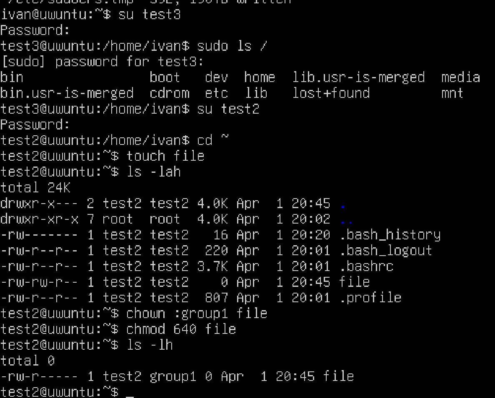

# Лабораторная работа 1
Выполнил: Скворцов Иван, K3320

## Введение

В данной лабораторной работе мы познакомимся с системой пользователей в линукс и системой прав

## Ход работы

Для создания пользователей воспользуемся командой `adduse <username>`. Снизу можно увидеть процесс создания пользователя test1

Аналогично создалим пользвоателей test2, test3, test4. Чтобы проверить, что пользователи успешно солздались, выведем список пользователей командой `cat /etc/passwd` 

В конце списка действительно есть созданные пользвоатели. 

Разрешим test1 и test2 получение полномочий root командой `sudo visudo`

Проверим, что всё работает

Создадим файлы в домащних директориях пользователей test3, test4

Разрешим получение полномочий пользователю test3 только для команды tcpdump

Создадим группы group1 и group2. Добавим пользователей test2, 3 в group1, test1, 4 в group2

Для group1 добавим разрешим получение полномочий root

Теперь создадим файл под пользователем test2 и настроим, чтобы у group1 был доступ на чтения, а у group 2 не было доступа на чтение, запись и исполнение

Удалим созданные группы и пользователи

## Выводы

В ходе данной работы мы успешно создали группы и пользователей, а так же настроили права доступа