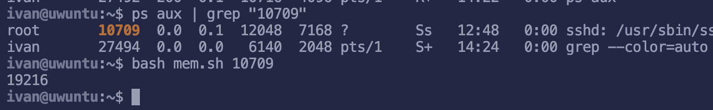

# Лабораторная работа 2
Выполнил: Скворцов Иван, K3320

## Ход работы

### Задание 1
Надо создать программу с утечкой памяти и проследить за ней с ипользованием top и ps.

Чтобы имитировать утечку памяти создадим баш скрипт, который будет постоянно увеличивать потребление памяти создавая массивы, его код можно увидеть на рисунке ниже

Запустим его и проследим за ним с использованием утилит `top` и `p`. В top отсортируем процессы по потреблению памяти комбинацией `shift+M`, в `ps` передадим аргументы `aux --sort rss` которые так же позволят отсортировать процессы по потребюлению памяти. Как мы видем на рисунке ниже, наш процес топ 1 по этому показателю

### Задание 2

В данном задании надо создать ситуацию, при которйо будет зомби процесс.

Для этого введем в терминале команду `(sleep 1 & exec /bin/sleep 60)`. В ней сначала выполняется процесс `sleep 1` и потом создается дочерний процесс `sleep 60`, однако `sleep 1` завершает своё выполнение, из-за чего процесс `sleep 60` становится зомби.  Вывдем зомби процессы комадной `ps aux | grep 'Z'. Среди них можно увидеть запушеный процесс sleep. 

### Задание 3
Реализуем следующие регулярные задачи
- удаление каждый день старых файлов из /tmp (каждый день)
- создание архива логов
- резеврное копирование /etc/

Создадим таблицу для задач командой `sudo crontab -e`. Выполнений от рута нужно, чтобы кронджобы так же выполнялись в привелгированном режимек

Далее внесем наши кронтаб, их можно увидеть на рисунке ниже

### Задание 4

Ниже будет скрипт, в котором с использованием утилиты `awk` сначала находится строка, где PID равен переданном пользователем и из это	строки берутся нужные значения VSZ и RSS. Далее через `read` строка с этими знаечениями преобразуется в два числа которые мы и складываем. Пример работы и код ниже

VSZ - это виртуальная память, выделенная процессу, то есть это значение не отображает реальное потребление памяти

RSS - количество реально используемой ОЗУ