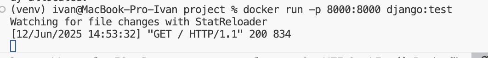
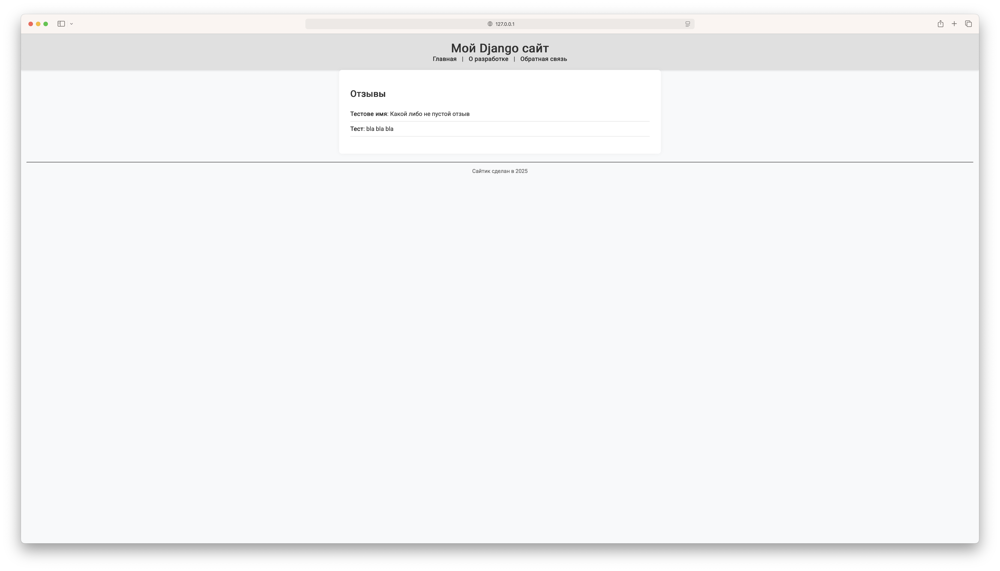

# Лабораторная работа 3
Выполнил: Скворцов Иван, K3320

## Ход работы

Возмем проект на Django, который был сделан в рамках другой учебной дисциплины (https://github.com/kloV148/WebDevelopment_2024-2025/tree/feat/lab7-8)

Напишем для него Dockerfile. Далее соберем образ командой `docker build . -t django:test`

В нем за основу берем образ с python, копируем зависимости, устанавливаем их и потом копируем сам проект. Это сделано чтобы в случае изменения проекта не приходилось пересобирать слои с зависимостями Далее в CMD запускаем проект. Запуск происходит командой 

`docker run -p 8000:8000 django:test` в которой мы указывваем, что надо пробросить порт 8000. проверяем работоспособность

Как видим, всё работает

